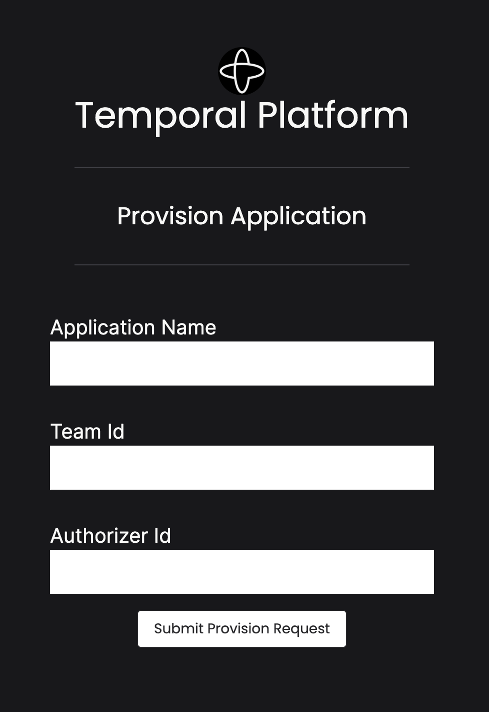
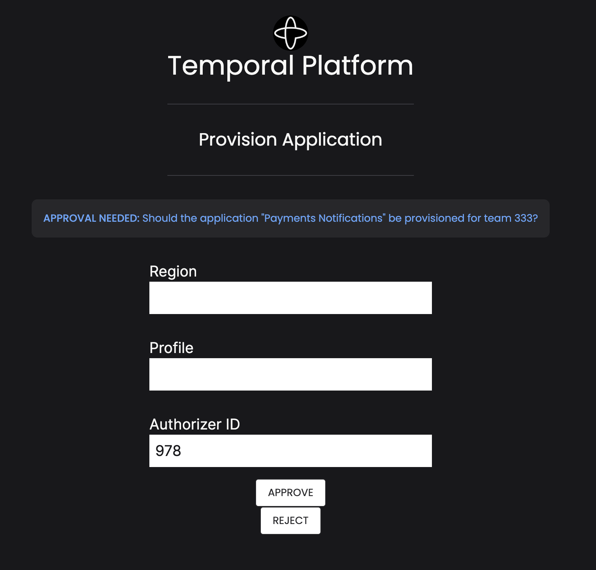

# Temporal Demo: Infrastructure Provisioning

_See [HOWTORUN.md](HOWTORUN.md) for details on environment and dependencies setup._

## Purpose

This demo is a simple application an Infrastructure/Platform team might host to simplify
application team requests for Cloud Resources. It shows how a team might use Temporal to orchestrate Cloud Resource provisioning by 
delegating to an Infrastructure-As-Code (IaC) tool like [Pulumi](https://www.pulumi.com/).

It is common for Infrastructure teams to use an IaC tool to manage Cloud Resources because of their great state management
and dependency resolution features. 

Automating failure handling during these updates or orchestrating units of these resources for application team support quickly reveals
the need for an orchestrator that can ensure your infrastructure remains in a consistent state.

### Caveats 

This demo presumes local ability to create and manage AWS Resources. Also, it writes changes
to the Pulumi stack configuration in-place. Neither of these are admittedly "production grade" approaches.

### Prerequisites
| Prerequisite       | ✅ |
|:-------------------|---|
| Network Connection | ✅  |
| Golang 1.18+       | ✅ |
| NodeJS & NPM       |  ✅ |
| Temporal CLI       |  ✅ |
| Pulumi             |  ✅ |
| AWS Account        |  ✅ |

### Features
| Feature        | ✅ | 
|----------------|-|
| Schedule       | |
| Local Activity | |
| Signal         | ✅ |
| Query          | ✅ |
| Update         | |
| Heartbeat      | ✅|
| Timer          | ✅ |
| Activity Retry | ✅ |
| Cron           | |   
| Data Converter | |
| Polyglot       | ✅|

### Patterns
| Pattern             | ✅ |
|---------------------|---|
| Entity              |   |
| Fanout              |   |
| Long-polling        |   |
| Continue As New     |   |
| Long-running        | ✅ |
| Manual Intervention | ✅ |
| Saga                |   |

## Temporal Value Proposition Highlights

### Velocity

**Polyglot Pragmatism**

This project was started as a Golang project but the most relevant Pulumi sample used TypeScript.
Targetting a specific `TaskQueue` from the Golang Orchestration that maps to a hosted TypeScript application kept
development humming along without a hitch. No porting or rewrites needed.

**Resuming Progress Made Simple**

Resuming a use case in response to a Human interaction is non-trivial to build without Temporal.
Using Temporal, it's merely a matter of wiring a Signal execution to a known Workflow. Temporal takes care of
reloading current state and finding the Workflow without worrying about "which server" is handling the request.

## Reliability

**Heartbeats**

Cloud Resources can take a long time to provision. The built-in support for Heartbeats in long-running
activities is simply a configuration parameter to control the rescheduling of Activity executions. 

**Guaranteed Time Limits**

The use of `AwaitWithTimeout` makes it simple to wait for Human interaction while applying a time limit
on their response. There is no more need to continually query persistence for these kinds of 
time limits to invalidate requests correctly.

## Visibility

**Show Me Why It Broke**

Failures encountered in Long-running Activities in any system are hard to diagnose due to 
log overload. Temporal UI `Pending Activities` view makes it clear whether there is
some connectivity issue or some conflict with refreshing Pulumi state to know where to fix the
real problem.

## Use Case: Provisioning An Application

### The Underlying Applications

Four distinct applications come together to meet this use case.

1. `/internal`: (Golang) contains implementation of the Domain, leveraging Temporal Workflow Orchestration to express the use cases.
1. `/provisioning_aws`: (TypeScript) contains the AWS-specific activities for provisioning Cloud Resources.
1. `/bff`: (Golang) contains the backend API server to support the Single-Page Application (SPA). _NOTE_ that the `Temporal SDK Client` is used here to **Start** Workflows.
1. `/ui`: (TypeScript) contains the Svelte SPA application teams and infra teams use

See the [Makefile](Makefile) for specific commands to run these applications.

### Use Case: Product Scope And Requirements

The implementation here only supports AWS but supporting other cloud providers
becomes quickly obvious by targeting Temporal [Task Queues](https://docs.temporal.io/workers#task-queue).

First, the team enters basic information about their application, team, and who they would like to `authorize` the request for provisioning
resources.

The demo then shows what the `Authorizer` they specified will see.

The `Authorizer` specifies the AWS Region and AWS Profile to use for completing the provisioning request (if approving).

The `Authorizer` selects to **Approve** or **Reject** this request. 

An appropriate response page is shown based on their selection.

### Use Case Implementation: Staging An Application Provisioning Workflow

When the user `Submit`s the request, a Temporal Workflow is started, performing some 
initial steps like verifying team identity and other pre-flight checks. The Orchestration
is then suspended to await the `Authorizer` "Approved" or "Rejected" decision.
By default, the request will wait for **2 minutes** to receive an authorization before canceling the request.

> The Golang "domain" code for the Orchestration is found in the `/internal/orchestrations` directory.

### Use Case Implementation: Authorizing An Application Request (Human-in-the-loop)

When the `Authorizer` has **approved** this request, the [ProvisionApplication](internal/orchestrations/provision_application.go) Orchestration
receives this [Temporal Signal](https://docs.temporal.io/workflows#signal) to allow the suspended Workflow to make progress. This Signal includes
the Authorizer's assignment of AWS `region` and which `Profile` to use to execute the Pulumi update.

For simplicity, we opted to merely adapt the Pulumi sample found [here](https://github.com/pulumi/automation-api-examples/tree/main/nodejs/localProgram-tsnode/automation) to programmatically
use Pulumi to deploy an S3 Bucket to AWS. 

You might notice this sample is **written in TypeScript** but our primary Orchestration logic
is written in Golang. 

_Enter Temporal's simple, powerful way to support _polyglot applications_._

Many organizations must unify disparate languages. Temporal solves this
by making it simple to target specific hosts for Activity executions using 
the `TaskQueue` activity option. Teams can choose the **Right Tool for the Job** while retaining the composition
every architecture strives for. Temporal supports **six languages**.

In this demo, we create an "Activity Worker" that hosts the [Pulumi automation](provisioning_aws/src/automation) to be
invoked as an Activity by the main Orchestration. 

> The TypeScript Pulumi application is found in the `/provisioning_aws` directory.

